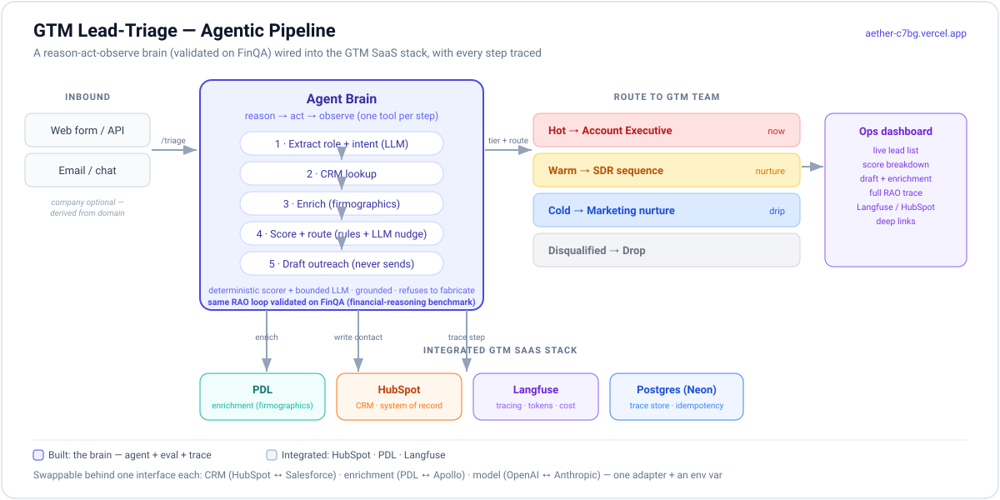

# Aether — Agentic GTM Lead-Triage

An agentic pipeline that triages inbound sales leads — reads the message, enriches the company, scores and routes the lead, drafts outreach — with every step traced. The reasoning brain is a reason-act-observe (RAO) loop **validated on the FinQA financial-reasoning benchmark**; here it's wired into the **GTM SaaS stack** (HubSpot, People Data Labs, Langfuse) and validated on its own held-out lead-qualification eval.

**Build the brain, integrate the body.** The decision brain — the agent, its eval, its trace — is built here. The CRM (HubSpot), enrichment (PDL), and observability (Langfuse) are integrated through swappable interfaces, not rebuilt.

> **Live demo:** [aether-c7bg.vercel.app](https://aether-c7bg.vercel.app/) — `/` is the lead form, `/ops` is the operator dashboard.

---

## What it does

A lead arrives — often just a name, an email, and a sentence (company optional). The agent reads what they said, looks them up in the CRM, enriches the company from the email domain, scores them with deterministic rules plus a bounded LLM nudge, assigns a tier (hot / warm / cold / disqualified) and a route (AE / SDR / marketing / drop), drafts outreach (never sends), writes the result to HubSpot, and produces a full auditable trace. The agent reasons one step at a time — different leads take different paths.

Three things distinguish it:

- **Grounded.** Every score traces to a signal; enriched fields carry source + confidence. The agent flags or refuses rather than inventing data.
- **Observable.** Every step, tool call, and observation is written to a trace store and shown in the ops dashboard, with Langfuse + HubSpot deep links.
- **Honest evaluation.** The eval is de-gamed — leads independently labeled, no keyword leakage — and the number is reported as-is, false-hot vs. false-cold tracked separately.

---

## Agent Architecture

A reason-act-observe loop with a deterministic execution core. The agent reasons about one action at a time, observes the result, and decides the next — the path is discovered at runtime, not planned upfront. This is the same architecture **validated on FinQA** (financial reasoning) in the core engine; it's domain-agnostic, and here it's applied to lead qualification.


The **loop agent** picks one tool per step. The **executor** is deterministic for data operations — no LLM in the loop. The deliberate exception is the bounded synthesis step (the **grounding guard**), which refuses rather than fabricating from absent evidence. The **scorer** is a transparent rule engine; the LLM gets only a clamped ±10 nudge, never the decision. Every step is written to a **trace store** — auditability is first-class.

---

## GTM Architecture

How the brain connects to the GTM SaaS stack — intake, enrichment, CRM, tracing, routing — all behind swappable interfaces.



**Live: [aether-c7bg.vercel.app](https://aether-c7bg.vercel.app/)** — submit a lead on `/`, watch it triage, and see the full reasoning trace on `/ops`.

The stack is genuinely swappable — each backend is one adapter behind an interface (verified in the [transferability audit](gtm-lead-triage/docs/audit/TRANSFERABILITY_AUDIT.md)):

| Layer | Built / integrated | Swap to |
| --- | --- | --- |
| CRM | HubSpot (v3 REST) | Salesforce — one adapter + env var |
| Enrichment | People Data Labs | Apollo / Clearbit — one adapter |
| Model | OpenAI `gpt-4o-mini` | Anthropic — one adapter + env var |
| Trace store | Postgres (Neon) | SQLite (local) |

Full GTM writeup in [gtm-lead-triage/README.md](gtm-lead-triage/README.md).

---

## Results

| Eval | Scope | Result |
| --- | --- | --- |
| GTM lead qualification | de-gamed held-out (n=35) | **62.9% tier accuracy · zero false-hots · 12.5% false-cold** (reproducible, temp-0) |
| Brain validation (FinQA) | n=200, Number-Match v2 | 75.5% lenient / 68.5% strict — same RAO architecture |
| Retrieval (core engine) | n=200 | R@5 0.85 · MRR@3 0.733 |
| Test suite | full | 486 passing · mock eval gate on every push · 76% coverage floor |

The GTM eval is **de-gamed**: leads are independently labeled (not derived from the rules), company names carry no industry-keyword leakage, and results are reported at the floor — false-hot vs. false-cold separately. Full progression in [gtm-lead-triage/DECISION.md](gtm-lead-triage/DECISION.md).

---

## Key design decisions

- **Deterministic decision, bounded LLM.** The tier comes from a transparent rule engine; the LLM gets a clamped ±10 nudge, never the decision. Auditable, evaluable, stable.
- **Grounded, never fabricated.** Enriched fields carry source + confidence; the agent refuses/flags rather than inventing.
- **Swappable backends.** CRM, enrichment, model, and trace store each sit behind one interface — Salesforce / Apollo / Anthropic are one adapter each, proven by the transferability audit.
- **Direct SDK, no LangChain.** Every decision is visible code — no framework hiding retry logic or prompt assembly.
- **Eval-driven + honest.** The held-out set is write-once; tuning happens on a separate dev split; the number is reported as-is. (A gamed eval was caught and rebuilt — the de-gamed number is what's reported.)

---

## Stack

| Layer | Choice |
| --- | --- |
| API / brain | FastAPI · Python 3.11 · direct OpenAI/Anthropic SDK (no LangChain) · Pydantic v2 |
| Enrichment | People Data Labs (waterfall: email validation → PDL → website read) |
| CRM | HubSpot v3 REST (swappable: SQLite / Salesforce) |
| Scoring | deterministic rules + clamped LLM nudge |
| Observability | Langfuse · structured JSON logging · `/metrics` · `/ready` |
| Persistence | Postgres (Neon) / SQLite · idempotency keys |
| Frontend | Next.js + Tailwind (Vercel) · two views: lead form + ops dashboard |
| Deploy | Vercel (frontend) · Render (API, Docker) · Neon (Postgres) |

---

## Quickstart

```bash
cd gtm-lead-triage
python -m uvicorn gtm_triage.api:app --port 8000   # API (falls back to mock if no OPENAI_API_KEY)
cd web && npm run dev                              # frontend
```

Open `http://localhost:3000` (lead form) and `http://localhost:3000/ops` (dashboard).

The core financial-reasoning engine — the FinQA-validated brain — lives in `aether/`; run its Streamlit app with `uv run streamlit run ui/app.py`.

---

## Repository layout

```
aether/
├── aether/              core reasoning engine (RAO agent, validated on FinQA)
├── gtm-lead-triage/     the GTM application
│   ├── gtm_triage/      pipeline: extraction, enrichment, scoring, CRM, trace
│   ├── web/             Next.js: lead form + ops dashboard
│   ├── evals/           de-gamed held-out + dev split + metrics harness
│   └── docs/            ARCHITECTURE.md, BACKLOG.md, pipeline.svg, audits
├── ui/app.py            Streamlit (core engine: Run / Trace / Eval)
└── docs/                validation log
```

---

## What this is not

Not a framework wrapper (no LangChain — hand-rolled orchestration is the point). Not a general assistant. Not benchmark-chasing — numbers reported at the floor. The agent decides; the LLM only nudges.

---

Cody Lee · [codylee.tech](https://codylee.tech) · [github.com/clee12111](https://github.com/clee12111)
