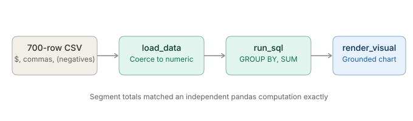
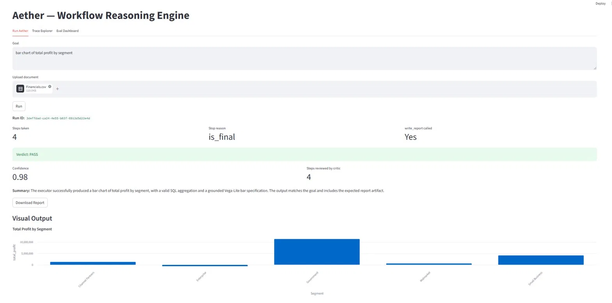
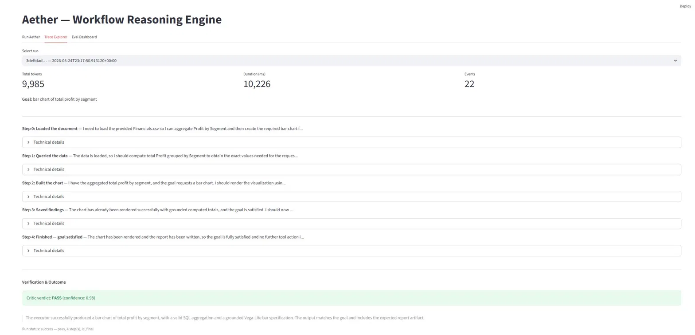
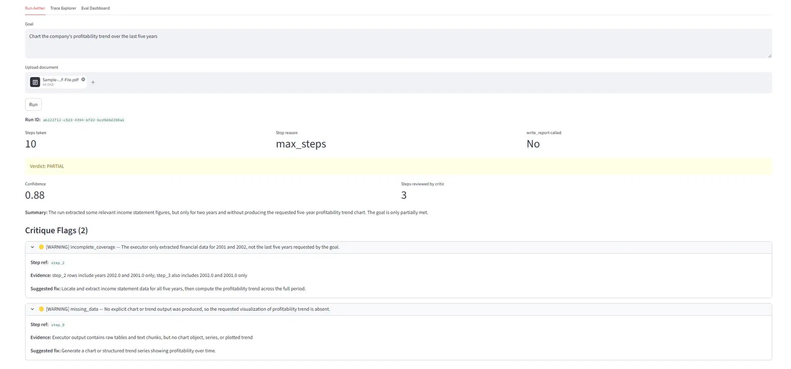
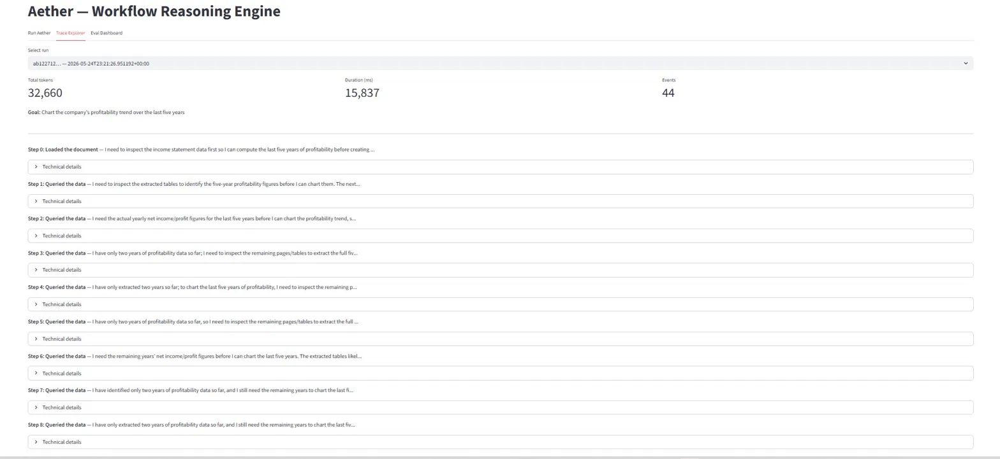

# Aether — Workflow Reasoning Engine

Give Aether a financial document and a plain-language goal. It reasons one step at a time, calls tools to load and query the data, builds a grounded visualization, and produces an auditable answer with a full reasoning trace — or refuses, honestly, when the document can't support the question.

**Every number it shows traces back to a source cell. When the evidence isn't there, it declines rather than fabricates.**

---

## Choose your depth

| Format | Time | What it is |
| --- | --- | --- |
| **This README** | ~6 min | The product, the architecture, the honest numbers, and the limitations. Start here. |
| **[Validation log](docs/aether-validation-log.md)** | varies | The chronological engineering record — every measurement, every bug, every honest correction. |
| **Run it** | ~10 min | `uv sync`, add an API key, `streamlit run ui/app.py`. Drop in a CSV or financial PDF and ask for a chart. |

---

## The headline

```
Document in, grounded visual out — every value traceable to a source cell.
75.5% end-to-end on FinQA (n=200), measured honestly and corrected downward
  from an early, wrong 87%.
700-row financial dataset aggregated to per-segment totals that matched an
  independent computation exactly.
Stress-tested with two adversarial prompts — it refused to fabricate both times.
```

The most important property is not the accuracy number — it's what the engine does when it *can't* answer. Asked to chart five years of data from a two-year document, it searched the available tables, found only two years, and returned a PARTIAL verdict with the evidence for why — rather than inventing three years to fill the chart. For a tool meant for financial work, refusing to fabricate is the feature that matters.

And the accuracy number itself is a measurement story. An early run reported 87%. Inspecting the scorer revealed it was crediting wrong answers — the instrument was lying, not the engine. Corrected, the number fell to 68.5%, then settled at a defensible 75.5% after real fixes. The honest 75.5% is worth more than the inflated 87%, and learning to distrust the measurement before trusting the result is the core skill this project demonstrates.

---

## Architecture

A reason-act-observe loop with a deterministic execution core and a verification step. The agent reasons about one action at a time, observes the result, and decides the next step — the path is discovered at runtime, not planned upfront.


The **loop agent** picks one tool per step. The **executor** dispatches it with no LLM in the loop for data operations — `load_data`, `run_sql`, `render_visual` are deterministic. The one deliberate exception is `answer_from_context`, the **grounding guard**: an isolated, audited synthesis step that returns `INSUFFICIENT_CONTEXT` rather than fabricating from absent evidence. The **critic** compares the final output to the goal and returns a structured verdict. Every reasoning step, tool call, and observation is written to a SQLite **trace store** — auditability is a first-class concern, not an afterthought.

---

## It works on different document types — same engine

The point of the engine is that the reasoning, SQL, and charting layers don't care where the data came from. Only the ingestion front-end differs. Two verified paths:

**A spreadsheet of transactions** — load, clean messy accounting notation, aggregate, chart.



**A financial statement PDF** — extract the tables first, then the same path.


Same executor, same SQL, same grounded chart. That's generalization across input types, shown rather than claimed.

---

## See it work

Asked for a bar chart of total profit by segment over a 700-row financial dataset, the engine loaded and cleaned the data, ran a SQL `GROUP BY`/`SUM`, and rendered a grounded chart. The per-segment totals matched an independent pandas computation to the cent — including the Enterprise segment correctly showing as a loss.



The reasoning is legible, not a debug dump. The trace reads as a narrative — loaded the document, queried the data, built the chart, saved findings — with the full SQL and tool calls one click away under each step.



### The part that matters: it refuses to fabricate

Asked to chart a *five-year* profitability trend from a document containing only *two* years, the engine did not invent the missing three. It searched the available tables, found two years, and returned a PARTIAL verdict — with the critic citing the exact evidence: the rows contain 2002 and 2001 only.



The reasoning trace shows *why* — ten query steps, each one looking for the missing years and not finding them, ending in an honest partial result rather than a fabricated chart.



This is the failure mode that matters for financial AI: a confident, plausible, wrong answer is worse than no answer. The engine is built so the second can't quietly become the first.

---

## Results

| Eval | Scope | Result |
| --- | --- | --- |
| End-to-end (FinQA) | n=200, gpt-5.4-mini, table-routing | **75.5% raw** (151/200); 79.5% on benchmark-fair questions (10 records excluded as benchmark-defective, enumerated in the validation log) |
| Retrieval | n=200, 512/100 shipped config | R@1 0.675 · R@3 0.81 · R@5 0.85 · MRR@3 0.733 · nDCG@5 0.769 |
| Generalization | finance, legal, medical | Same engine, no code changes |
| Grounding guard | adversarial prompts | Refused to fabricate in both stress tests |

Numbers are reported at the floor, not the peak, and corrected in the unflattering direction when the instrument was found wrong. Retrieval recall is flat (±0.01 R@5) across chunk sizes from 512 to 1500; 512/100 is the shipped default. The end-to-end figure was measured at the 800-chunk config and is stable across the config change.

---

## Key design decisions

- **Reasoning is provider-swappable; the pipeline is local.** Default reasoning is OpenAI gpt-5.4-mini; a local Ollama model is supported as a fallback and comparison baseline. Retrieval, embeddings, reranking, execution, and the trace store all run locally regardless.
- **Direct SDK, no LangChain/LangGraph/CrewAI.** Every decision in the system is visible code — no framework abstraction hiding retry logic, prompt assembly, or output parsing.
- **Deterministic executor.** Data operations (load, SQL, chart) have zero LLM calls. The one synthesis tool that uses an LLM is isolated and audited. Determinism where it's possible, an explicit traced step where it isn't.
- **Grounded visuals.** `render_visual` builds chart specs from computed tool outputs only — values are copied verbatim, never model-generated. It returns `insufficient_data` rather than charting numbers it can't ground.
- **Pydantic on every agent output, with retry-on-error.** LLM non-determinism is turned into structured reliability by validating every response and feeding validation errors back for a retry.
- **Distrust metrics until the instrument is verified.** The hardest-won lesson: several apparent engine failures were measurement bugs — truncation caps, parsing gaps, scorers crediting wrong answers. Inspect raw behavior before concluding the system is wrong.

---

## Honest limitations

- **Multi-section table extraction.** The PDF table extractor (Camelot stream-mode) splits some statements that place two sections on one page — a balance sheet's assets and liabilities, for instance — capturing only the first. Asked to compare current assets to current liabilities, the engine searches honestly and returns a partial result rather than fabricating the missing half; but the comparison can't complete. Layout-aware parsing is the fix, and it's future work.
- **No graceful early termination.** When the requested data genuinely isn't extractable, the engine searches to its step ceiling rather than concluding "this isn't here" and writing a partial report sooner. The result is honest; the path to it is wasteful.
- **No OCR.** Ingestion uses text extraction — born-digital PDFs, CSVs, and text files work; scanned image-only PDFs do not.

---

## Stack

| Layer | Choice |
| --- | --- |
| Reasoning | OpenAI gpt-5.4-mini (default, provider-swappable); local Ollama fallback |
| Retrieval | BM25 + dense (ChromaDB) → RRF merge → cross-encoder rerank |
| Embeddings | sentence-transformers (all-MiniLM-L6-v2) |
| Execution | DuckDB (SQL) + pandas |
| PDF tables | Camelot stream-mode + financial-number coercion |
| Charts | Vega-Lite (grounded specs) |
| Validation | Pydantic v2 |
| Trace | SQLite (WAL) |
| UI | Streamlit |

---

## What this is not

- **Not a framework wrapper.** No LangChain/LangGraph/CrewAI. Hand-rolled orchestration is the point — every decision is visible.
- **Not a general assistant.** It reasons over documents toward a goal; it is not a chatbot.
- **Not a benchmark-chasing project.** The accuracy number is reported honestly and conservatively. The measurement discipline is the deliverable as much as the engine is.
- **Not finished.** The limitations above are real and named, not hidden.

---

## Quickstart

```bash
uv sync                                    # install
cp .env.example .env                       # add your reasoning-provider API key
uv run streamlit run ui/app.py             # launch: Run / Trace Explorer / Eval Dashboard
```

Drop a CSV or a financial PDF into the Run tab, type a goal in plain language ("bar chart of total profit by segment"), and watch the reasoning trace, the grounded chart, and the verdict.

---

## Repository layout

```
aether/
├── aether/              core engine
│   ├── agents/          loop agent, executor, critic, provider routing
│   ├── ingestion/       CSV/PDF/Excel/TXT → chunks; Camelot table extraction
│   ├── rag/             hybrid retriever (BM25 + dense + rerank)
│   ├── tools/           load_data, run_sql, retrieve_context,
│   │                    answer_from_context, flag_item, write_report, render_visual
│   ├── trace/           SQLite trace store
│   ├── runtime.py       run_agentic() RAO loop (+ run() baseline)
│   └── config.py        provider/model routing
├── ui/app.py            Streamlit: Run, Trace Explorer, Eval Dashboard
├── evals/               retrieval + end-to-end suites; FinQA n=200 scripts; results/
├── data/demo/           sample documents (finance, legal, medical)
├── docs/                validation log, journal, archived analysis
└── assets/              diagrams + screenshots
```

---

## Author

Cody Lee · [codylee.tech](https://codylee.tech) · [github.com/clee12111](https://github.com/clee12111)