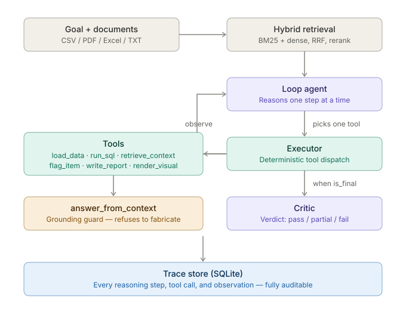
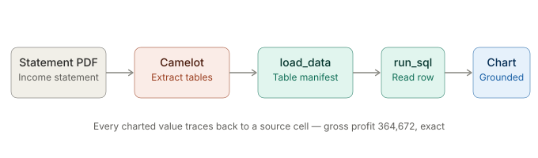
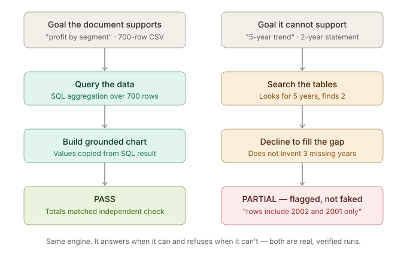

# Aether — Workflow Reasoning Engine

Give Aether a financial document and a plain-language goal. It reasons one step at a time, calls tools to load and query the data, builds a grounded visualization, and produces an auditable answer with a full reasoning trace — or refuses, honestly, when the document can't support the question.

**Every number it shows traces back to a source cell. When the evidence isn't there, it declines rather than fabricates.**

---

## What it does

Financial questions over documents are messy: the data is in a PDF table or a 700-row CSV with dollar signs and parenthesized negatives, and the steps to answer vary with the question. Aether takes the document and the goal, figures out the steps, runs them, and returns a chart or a number with the full reasoning recorded.

Three things distinguish it:

- **Grounded output.** Charts and figures are built from computed tool results, copied verbatim. The engine does not generate numbers — it reads them from a SQL query, and every value traces back to a source cell.
- **Observable reasoning.** Every step, tool call, and observation is written to a trace store and shown as a readable sequence — you can see how an answer was reached, or why one wasn't.
- **Refuses rather than fabricates.** When the document can't support the question, it returns a partial result with the evidence for why, instead of inventing data to fill the chart.

Numbers: 75.5% end-to-end on FinQA (n=200); a 700-row dataset aggregated to per-segment totals matching an independent computation exactly; two adversarial stress tests, no fabrication in either.

---

## Architecture

A reason-act-observe loop with a deterministic execution core and a verification step. The agent reasons about one action at a time, observes the result, and decides the next — the path is discovered at runtime, not planned upfront.



The **loop agent** picks one tool per step. The **executor** dispatches it with no LLM in the loop for data operations — `load_data`, `run_sql`, `render_visual` are deterministic. The one deliberate exception is `answer_from_context`, the **grounding guard**, which returns `INSUFFICIENT_CONTEXT` rather than fabricating from absent evidence. The **critic** compares the output to the goal and returns a verdict. Every step is written to a SQLite **trace store** — auditability is first-class, not an afterthought.

It works the same regardless of input type — only the ingestion front-end differs. A PDF statement has its tables extracted first; a CSV loads directly; both run through the same SQL and charting layers.



---

## Behavior: it answers when it can, refuses when it can't

The distinguishing property, shown on two real runs:



Asked for profit by segment over a 700-row dataset, the engine aggregated with SQL and charted the result — totals matching an independent pandas computation to the cent. Asked to chart a five-year trend from a two-year document, it searched the tables, found only two years, and returned a PARTIAL verdict citing the exact evidence — rather than inventing the missing three years. A confident, plausible, wrong answer is worse than no answer; the engine is built so the first can't quietly become the second.

---

## Results

| Eval | Scope | Result |
| --- | --- | --- |
| End-to-end (FinQA) | n=200, gpt-5.4-mini | **75.5% raw** (151/200); 79.5% benchmark-fair (10 defective records excluded, enumerated in the validation log) |
| Retrieval | n=200, 512/100 shipped config | R@1 0.675 · R@3 0.81 · R@5 0.85 · MRR@3 0.733 · nDCG@5 0.769 |
| Generalization | finance, legal, medical | Same engine, no code changes |
| Grounding guard | adversarial prompts | Refused to fabricate in both stress tests |

Numbers are reported at the floor, not the peak. Retrieval recall is flat (±0.01 R@5) across chunk sizes 512–1500; 512/100 is shipped. Full chronological record — every measurement, bug, and correction — in the [validation log](docs/aether-validation-log.md).

---

## Key design decisions

- **Reasoning is provider-swappable; the pipeline is local.** Default reasoning is OpenAI gpt-5.4-mini; a local Ollama model is supported as fallback. Retrieval, embeddings, reranking, execution, and trace all run locally regardless.
- **Direct SDK, no LangChain/LangGraph/CrewAI.** Every decision is visible code — no framework hiding retry logic, prompt assembly, or output parsing.
- **Deterministic executor.** Data operations have zero LLM calls. The one synthesis tool that uses an LLM is isolated and audited.
- **Grounded visuals.** `render_visual` builds chart specs from computed tool outputs only — values copied verbatim, never model-generated. Returns `insufficient_data` rather than charting what it can't ground.
- **Distrust metrics until the instrument is verified.** Several apparent engine failures were measurement bugs — truncation caps, parsing gaps, scorers crediting wrong answers. Inspect raw behavior before concluding the system is wrong.

---

## Honest limitations

- **Multi-section table extraction.** Camelot stream-mode splits some statements that place two sections on one page (a balance sheet's assets and liabilities), capturing only the first. The engine searches honestly and returns a partial result rather than fabricating the missing half — but the comparison can't complete. Layout-aware parsing is future work.
- **No graceful early termination.** When data genuinely isn't extractable, the engine searches to its step ceiling instead of concluding sooner. The result is honest; the path to it is wasteful.
- **No OCR.** Born-digital PDFs, CSVs, and text files work; scanned image-only PDFs do not.

---

## Stack

| Layer | Choice |
| --- | --- |
| Reasoning | OpenAI gpt-5.4-mini (provider-swappable); local Ollama fallback |
| Retrieval | BM25 + dense (ChromaDB) -> RRF -> cross-encoder rerank |
| Embeddings | sentence-transformers (all-MiniLM-L6-v2) |
| Execution | DuckDB (SQL) + pandas |
| PDF tables | Camelot stream-mode + financial-number coercion |
| Charts | Vega-Lite (grounded specs) |
| Validation | Pydantic v2 · Trace: SQLite (WAL) · UI: Streamlit |

---

## Quickstart

```bash
uv sync                                    # install
cp .env.example .env                       # add your reasoning-provider API key
uv run streamlit run ui/app.py             # launch: Run / Trace Explorer / Eval Dashboard
```

Drop a CSV or financial PDF into the Run tab, type a goal in plain language ("bar chart of total profit by segment"), and watch the reasoning trace, the grounded chart, and the verdict.

---

## Repository layout

```
aether/
├── aether/              core engine (agents, ingestion, rag, tools, trace, runtime, config)
├── ui/app.py            Streamlit: Run, Trace Explorer, Eval Dashboard
├── evals/               retrieval + end-to-end suites; FinQA n=200 scripts; results/
├── data/demo/           sample documents (finance, legal, medical)
├── docs/                validation log, journal, archived analysis
└── assets/              diagrams
```

---

## What this is not

Not a framework wrapper (no LangChain/LangGraph — hand-rolled orchestration is the point). Not a general assistant. Not benchmark-chasing — the accuracy number is reported conservatively. Not finished — the limitations above are real and named.

---

Cody Lee · [codylee.tech](https://codylee.tech) · [github.com/clee12111](https://github.com/clee12111)