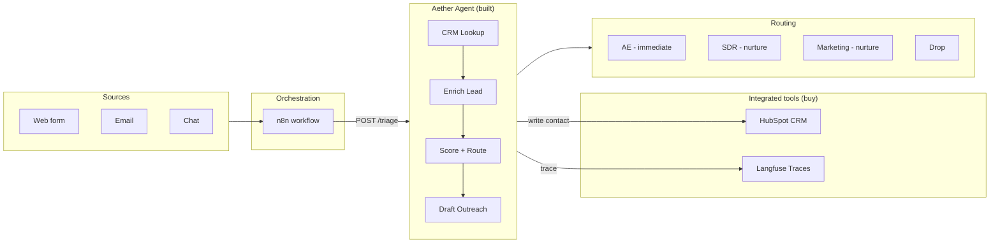

# Aether GTM - Agentic Lead Triage

Agentic reasoning for inbound lead triage, with full tracing.

An AI agent receives an inbound lead, reasons about it step by step (CRM
lookup, enrichment, scoring, outreach drafting), and routes it to the right
team. Every reasoning step, tool call, and decision is traced to SQLite and
optionally to Langfuse. The agent never sends anything - it triages, scores,
drafts, and hands off.

## Architecture

The reasoning loop is the same reason-act-observe (RAO) architecture validated
on the FinQA financial-reasoning benchmark in the core Aether engine (75.5%
on n=200, table-routed). Here, that proven loop is applied to inbound lead
triage and validated on its own task: a 22-lead human-labeled qualification
eval at 95.5% tier accuracy on seen leads, 90% on held-out leads.

**Build the brain. Buy the body.** The decision brain (the RAO agent + eval +
trace) is built. The orchestration (n8n), CRM (HubSpot), and observability
(Langfuse) are integrated, not rebuilt.



## The four tools

| Tool | What it does | LLM? |
|------|-------------|------|
| `crm_lookup` | Check for existing CRM record | No |
| `enrich_lead` | Infer industry, size, seniority (regex + LLM fallback) | Optional |
| `score_lead` | Deterministic rules + bounded LLM adjustment ([-10, +10]) | Optional |
| `draft_outreach` | Template-based draft email (never sends) | No |

The agent also exposes these as an **MCP server** (`gtm_triage/mcp_server.py`)
for integration with MCP-compatible clients.

## Eval

- **22 human-labeled leads** (seen): 95.5% tier accuracy, 95.5% route accuracy
- **10 held-out leads** (unseen, written after rules finalized): 90.0% tier accuracy
- **Mock CI gate**: 5/5 deterministic leads, runs on every change, no API key needed
- **Latency**: ~11.6s/lead (OpenAI gpt-4o-mini), ~0s (mock)
- **Cost**: ~$0.001/lead

The eval labels are human-judgment-first, not derived from the rules. Disagreements
are documented with root causes. No public lead-qualification benchmark exists;
these numbers are internal.

## The two-view web app

- **`/`** - Product lead-capture form with preset example leads (hot/warm/cold/spam/opt-out)
- **`/ops`** - Live ops dashboard: metric strip with tier filters, lead list with
  search, and a detail panel showing the draft outreach, score breakdown (rules +
  LLM adjustment), enrichment summary, and the full RAO trace grouped by phase

## Tracing and CRM

**Langfuse**: every LLM call is recorded as a generation (model, tokens, latency),
grouped under one trace per lead. No keys = no-op.

**HubSpot**: contacts with custom properties (tier, score, route, industry, seniority,
activity log). Swappable via `CRM_BACKEND` env; SQLite is the default for local dev.

## Running locally

```bash
cd gtm-lead-triage

# Terminal 1: API (defaults to openai; mock if no OPENAI_API_KEY)
python -m uvicorn gtm_triage.api:app --host 127.0.0.1 --port 8000

# Terminal 2: frontend
cd web && npm run dev
```

Open http://localhost:3000 (form) and http://localhost:3000/ops (dashboard).

### Environment variables

| Variable | Default | Purpose |
|----------|---------|---------|
| `GTM_PROVIDER` | `openai` | `openai` or `mock` |
| `GTM_MODEL` | `gpt-4o-mini` | Model for OpenAI provider |
| `OPENAI_API_KEY` | - | Required for openai provider |
| `CRM_BACKEND` | `sqlite` | `sqlite` or `hubspot` |
| `HUBSPOT_TOKEN` | - | HubSpot Private App token |
| `DAILY_QUERY_CAP` | `200` | Max OpenAI triage runs per UTC day |
| `LANGFUSE_PUBLIC_KEY` | - | Langfuse public key (optional) |
| `LANGFUSE_SECRET_KEY` | - | Langfuse secret key (optional) |
| `LANGFUSE_BASE_URL` | - | Langfuse host URL (optional) |
| `FRONTEND_ORIGIN` | `http://localhost:3000` | CORS allowed origins |
| `DATABASE_URL` | - | Postgres DSN (uses SQLite if absent) |

## Deploy

See [DEPLOY.md](DEPLOY.md) for click-by-click instructions:
Neon (Postgres) + Render (API) + Vercel (frontend).

## Scope guardrails

- **Draft-only**: outreach is drafted, never sent
- **No LangChain**: direct SDK, every decision is visible code
- **Daily LLM cap**: falls back to mock (free, deterministic) when the daily
  OpenAI quota is exhausted - the app never errors
- **Eval-gated**: the 5-lead mock CI gate runs on every change; no API key needed
- **Idempotent**: duplicate submissions return the cached result
